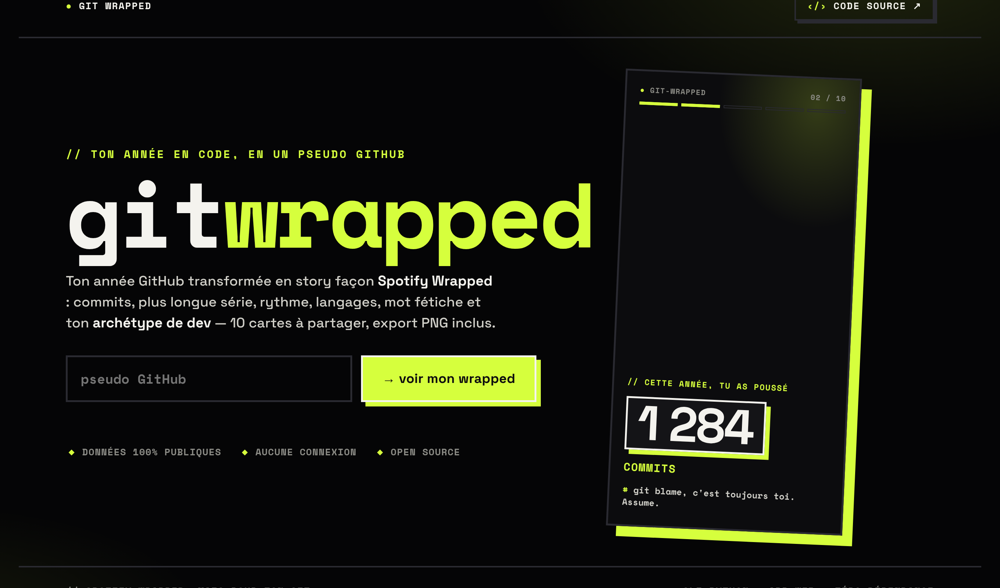
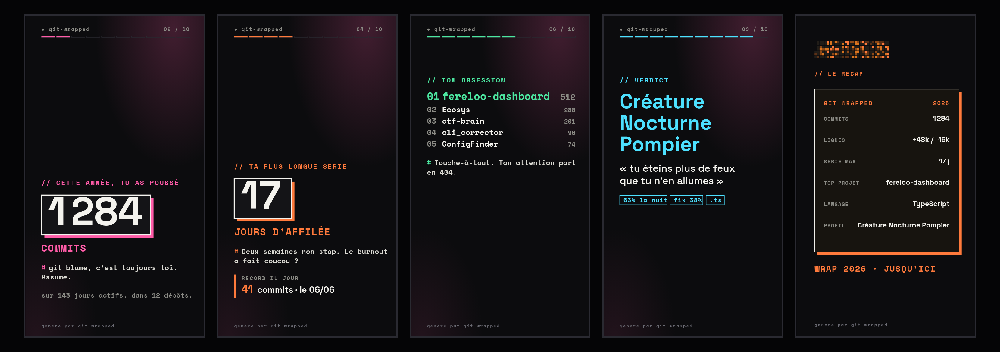

# Git Wrapped

Ton année GitHub transformée en story façon *Spotify Wrapped* : commits, plus
longue série, rythme, langages, mot fétiche et ton **archétype de dev** — 10
cartes à partager, export PNG inclus.

**→ Démo : [git-wrapped-teal.vercel.app](https://git-wrapped-teal.vercel.app)**





## Fonctionnalités

- **10 cartes** animées : intro, commits, rythme + calendrier de contributions,
  série la plus longue, lignes ajoutées/supprimées, top projet, top langage,
  mot de commit fétiche, archétype de dev, récap.
- **Quiz** : devine ton dépôt et ton mot n°1 avant la révélation.
- **Défilement auto** (~5 s/carte) avec play/pause, **musique** chiptune générée
  (ou un `web/music.mp3` déposé), navigation clavier / tap / swipe.
- **Export PNG** fidèle de chaque carte (SVG natif, polices embarquées) +
  partage natif.
- **Archétype** déterministe : 6 créneaux × 9 métiers (« Créature Nocturne
  Pompier », « Diurne Bâtisseur »…).
- **Deux fronts, une seule story** : le CLI Python et l'app web partagent le même
  moteur de rendu (`web/wrapped.js` + `web/wrapped.css`) et le même contrat de
  stats ; seule la source de données change.

## App web (pseudo GitHub)

L'app affiche le wrapped des **dépôts publics** d'un pseudo GitHub : on tape un
login, un backend interroge l'API GitHub GraphQL et calcule les stats **à partir
des commits publics uniquement** (aucune fuite d'activité privée).

### Déploiement (Vercel)

1. Importer le repo dans Vercel (ou `vercel --prod`).
2. Variable d'environnement **`GITHUB_TOKEN`** = un token GitHub en lecture seule
   (scope `read:user` / `public_repo` suffit ; sert à lire du public via GraphQL).
3. Déployer. L'accueil sert `web/index.html` ; l'API est
   `GET /api/wrapped?user=<login>&year=<YYYY>` (année par défaut = année courante).

> Le token reste **côté serveur** (variable d'env Vercel) et n'est jamais exposé
> au client. L'app ne montre que des données publiques.

## CLI local (tes dépôts git)

Aucune dépendance : Python 3 + git. Scanne tes dépôts locaux et génère un `.html`
autonome (polices embarquées en base64, zéro ressource externe).

```bash
python git_wrapped.py ~/Documents/Perso ~/code \
    --year 2026 \
    --author ton.email@example.com \
    -o wrapped.html
```

- `roots` : un ou plusieurs dossiers scannés récursivement (tout dépôt git
  dessous est inclus).
- `--year` : année couverte (défaut : année courante).
- `--author` : email git filtré (défaut : `git config user.email`).
- `-o` : fichier de sortie (défaut : `git-wrapped-<year>.html`).

Ouvre ensuite le `.html` dans un navigateur et fais défiler.

## Développement

Zéro dépendance npm côté backend (Node ≥ 20, `fetch` natif, `node:test`).

```bash
python -m unittest discover -s tests -v   # CLI (Python, stdlib)
npm test                                   # backend web (Node, node:test)
```

## Structure

```
git_wrapped.py        entrée CLI
gitwrapped/           discover · collect · analyze · render (Python)
lib/                  github-client · github-to-stats (backend web)
api/wrapped.js        fonction serverless (Vercel)
web/                  index.html · wrapped.js · wrapped.css · fonts (story partagée)
tests/ · test/        suites Python · Node
```
